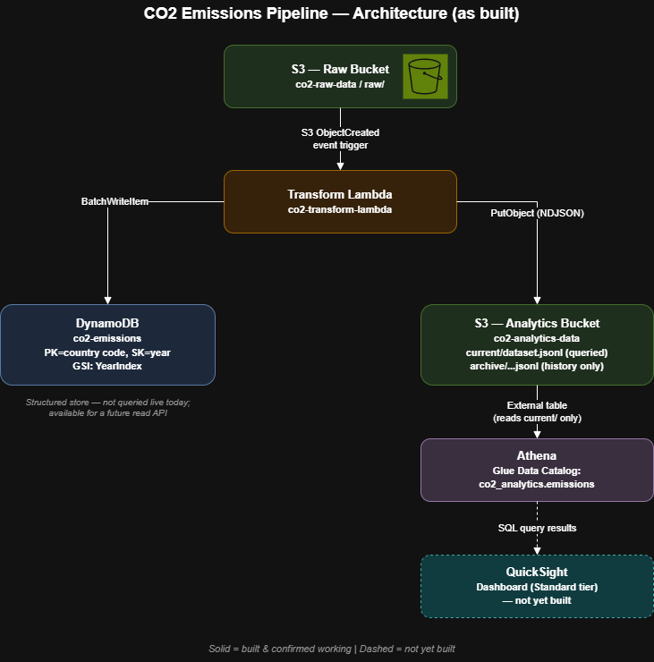

# 🌍 CO₂ Emissions Data Pipeline
Serverless AWS pipeline for processing and analysing annual CO₂ emissions data (2010–2024)  

This project ingests a curated global CO₂ emissions dataset, processes it through a serverless ETL pipeline, stores structured results in DynamoDB, and publishes analytics JSON for downstream APIs and dashboards.  

The architecture is lightweight, cost‑efficient, and designed for real‑time updates whenever new data is uploaded to S3.

---
### Columns

| Column | Description |
|--------|-------------|
| Entity | Country name |
| Code | ISO‑3166 alpha‑3 code |
| Year | Year of measurement |
| Annual CO₂ emissions | Emissions in tonnes (integer) |

The dataset is intentionally lightweight to keep the pipeline fast and inexpensive while still supporting meaningful global emissions insights.

---

## 📦 Dataset Overview

The pipeline processes a curated CSV containing:

- 35 countries + World aggregate (36 total entities)
- 15 years of data (2010–2024)  
- 540 total rows (541 including header)

---

## 🏗 Architecture Diagram

---

## 🔁 How the Pipeline Works

1. **Ingestion (S3 Raw bucket)**  
Raw CO2 emissions CSVs are uploaded to a dedicated S3 bucket, the landing zone for unprocessed data.

2. **Transformation (Lambda Function)**  
An S3 upload triggers a Lambda function that parses and validates the CSV, then writes in parallel to two destinations: DynamoDB for structured lookups, and a second S3 bucket for analytics.

3. **Structured Storage (DynamoDB Processed Table)**  
Transformed records are stored using a key system directly related to 'Year' and 'Country' for low-latency lookups. Not currently exposed to via a live API, but structured for that use case.

4. **Analytics Export (S3 Analytics Bucket)**  
In parallel, the same records that are sent to DDB, are also written as newline-delimited JSON to a second bucket. This particular format can be queried bu Athena directly, without any import step.

5. **SQL Querying (Athena)**  
An external table over the analytics bucket lets Athena run SQL directly against the S3 files, with no separate database or ETL required.

6. **Visualisation (QuickSight)**  
Quicksight connects to Athena as a data source to build the interactive dashboard.

---

## 📈 Future Improvements

- Add Glue Crawler for schema automation
- Add Api Gateway + Lambda for realtime lookups
- Add CloudWatch alarms and metrics
- Add S3 lifecycle policies
- Add CI/CD pipeline for Lambda deployments

---

## 📜 License

MIT License
