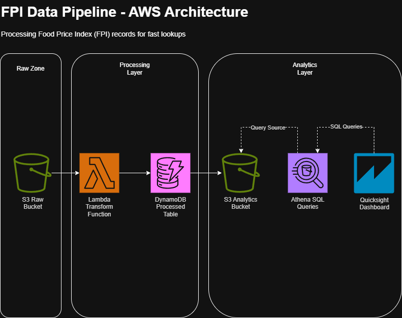

# 📊 FPI Data Pipeline (AWS Serverless Architecture)

A fully serverless AWS data pipeline for processing, storing, querying, and visualising Food Price Index (FPI) data.
Build using S3, Lambda, DynamoDB, Athena, and Quicksight.

--------------------------------------------------------------------------------------------------------------------

## 🌍 Overview

This project demonstrates an end-to-end pipeline that ingests raw Food Price Index data, transforms it using AWS Lambda, stores optimised records in DynamoDB for fast lookups, and publishes data to S3 where we can query for analytics using Athena, as well as creating visualisation for the data using QuickSight.

📌 The main goal is to showcase palatable, scalable and cost-efficient serverless architecture that is ready for real-world analytic workloads

--------------------------------------------------------------------------------------------------------------------

## 🏗 Architecture Diagram

--------------------------------------------------------------------------------------------------------------------

